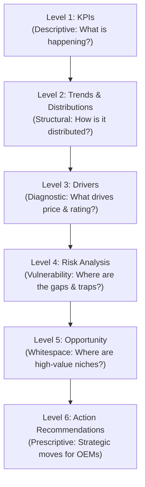

# Project Plan: Smartphone Market Intelligence & Pricing Analytics
**Academic Internship Track:** IBM SkillsBuild Data Analytics with AI  
**Role:** Lead Data Analytics Engineer  
**Dataset:** `data/smartphones.csv`  
**Status:** Reconnaissance & Project Planning Phase (Approved Baseline)

---

## 1. Executive Summary & Feasibility Assessment

### 1.1 Project Title & Core Objective
**"Smartphone Market Intelligence & Pricing Analytics: Data-Driven Analysis of Smartphone Pricing, Specifications, Brands, and Market Segments"**

The objective of this project is to perform an end-to-end data analytics and predictive modeling study on smartphone specifications, pricing mechanics, brand tiering, and market positioning within the Indian retail smartphone landscape. 

### 1.2 Feasibility Check: Does the Dataset Genuinely Support the Project?
**Verdict: YES, with clearly defined analytical boundaries.**

- **Supported Dimensions:**
  - **Pricing Mechanics:** Hedonic pricing analysis, price-per-gigabyte (RAM/Storage), charging speed premiums, and multi-tier pricing strategies across ₹4,040 to ₹2,29,900.
  - **Hardware Specifications:** Comprehensive technical profiles covering compute (clock speed, core count, processor brand/model), memory (RAM, storage), display (dimensions, resolution, refresh rate), battery/charging (capacity, wattage, fast charging), camera systems (front/rear count and main megapixels), and connectivity (5G, NFC, IR blaster).
  - **Brand & Competitive Positioning:** Comparative profiling across 26 smartphone brands and 6 processor architectures.
  - **Market Segmentation:** Clustering and stratification into distinct retail price segments (Budget, Lower-Mid, Mid-Range, Upper-Mid, Flagship/Ultra-Premium).
  - **Product Rating & Spec Benchmarking:** Evaluating composite specification quality (`rating_score`) against price to isolate value outliers and overpriced configurations.

- **Explicit Analytical Boundaries (What the Dataset CANNOT Claim):**
  - **No Sales Volume / Units Sold:** The dataset represents a cross-sectional snapshot of catalog listings/models available in the market. It does **not** contain sales units, shipment numbers, or revenue figures.
  - **No Actual Market Share:** Catalog representation (e.g., Realme having 134 models vs. Apple having 28) reflects **catalog offering breadth / SKU density**, NOT retail market share or unit sales volume.
  - **No Consumer Demand:** Absence of sales velocity, purchase frequency, or consumer review counts means demand cannot be directly measured.
  - **No Temporal / Historical Trends:** There is no timestamp, release date, or price history column. Analysis is strictly cross-sectional.
  - **No Causation:** Statistical correlations (e.g., higher storage correlating with higher price) represent market pricing structures, not causal cost relationships.

---

## 2. Dataset Profile

### 2.1 File Characteristics
- **File Path:** `data/smartphones.csv` (or `Data/smartphones.csv`)
- **Row Count:** 758 unique smartphone models
- **Column Count:** 27 variables
- **Duplicate Rows:** 0 exact duplicate rows; 758 unique model strings (100% uniqueness)
- **Memory Footprint:** ~127.4 KB raw CSV

### 2.2 Complete Variable Dictionary & Data Types

| # | Column Name | Raw Data Type | Recommended Type | Missing Count | Missing Pct | Description / Scope |
|---|---|---|---|---|---|---|
| 1 | `smartphone_brand` | `object` (string) | `category` | 0 | 0.00% | Brand / Manufacturer (26 unique brands) |
| 2 | `model` | `object` (string) | `string` | 0 | 0.00% | Full smartphone marketing name (758 unique) |
| 3 | `price_inr` | `int64` | `int64` | 0 | 0.00% | Retail price in Indian Rupees (₹) |
| 4 | `rating_score` | `int64` | `int64` / `float64` | 0 | 0.00% | Composite spec-based benchmark rating (37 to 97) |
| 5 | `processor_name` | `object` (string) | `category` | 0 | 0.00% | Detailed chipset model (125 unique chipsets) |
| 6 | `processor_brand` | `object` (string) | `category` | 0 | 0.00% | Chipset manufacturer (6 unique: MediaTek, Snapdragon, etc.) |
| 7 | `core_count` | `int64` | `int8` | 0 | 0.00% | Total CPU processing cores (1 to 10 cores) |
| 8 | `clock_speed_ghz` | `float64` | `float32` | 0 | 0.00% | Peak CPU operating frequency in GHz (1.0 to 4.47 GHz) |
| 9 | `ram_gb` | `int64` | `int16` | 0 | 0.00% | Physical system RAM in Gigabytes (2 to 24 GB) |
| 10 | `storage_gb` | `int64` | `int16` | 0 | 0.00% | Internal storage capacity in Gigabytes (32 to 2048 GB) |
| 11 | `has_5g` | `bool` | `bool` | 0 | 0.00% | 5G cellular connectivity flag (True / False) |
| 12 | `has_nfc` | `bool` | `bool` | 0 | 0.00% | Near-Field Communication flag (True / False) |
| 13 | `has_ir_blaster` | `bool` | `bool` | 0 | 0.00% | Infrared transmitter flag (True / False) |
| 14 | `display_inches` | `float64` | `float32` | 0 | 0.00% | Diagonal screen size in inches (3.75" to 8.03") |
| 15 | `res_width_px` | `int64` | `int16` | 0 | 0.00% | Horizontal display resolution in pixels (128 to 2400 px) |
| 16 | `res_height_px` | `int64` | `int16` | 0 | 0.00% | Vertical display resolution in pixels (160 to 3168 px) |
| 17 | `refresh_rate_hz` | `int64` | `int16` | 0 | 0.00% | Screen refresh frequency in Hertz (60, 90, 120, 144, 165) |
| 18 | `battery_mah` | `int64` | `int32` | 0 | 0.00% | Battery capacity in milliampere-hours (2,000 to 21,200) |
| 19 | `fast_charging` | `bool` | `bool` | 0 | 0.00% | Fast-charging capability flag (True / False) |
| 20 | `charging_watt` | `float64` | `float32` | 0 | 0.00% | Rated charging adapter wattage (5.0W to 125.0W) |
| 21 | `rear_camera_count` | `int64` | `int8` | 0 | 0.00% | Number of rear camera lenses (1 to 3) |
| 22 | `front_camera_count` | `int64` | `int8` | 0 | 0.00% | Number of front camera lenses (0 to 2) |
| 23 | `rear_camera_main_mp` | `float64` | `float32` | 0 | 0.00% | Primary rear camera sensor resolution in MP (8 to 200 MP) |
| 24 | `front_camera_main_mp` | `float64` | `float32` | 5 | 0.66% | Primary front camera sensor resolution in MP (5 to 50 MP) |
| 25 | `os_name` | `object` (string) | `category` | 0 | 0.00% | Operating System ecosystem (`android`: 730, `ios`: 28) |
| 26 | `memory_card_supported` | `object` (nullable) | `boolean` | 207 | 27.31% | MicroSD expansion support (True: 383, False: 168, NaN: 207) |
| 27 | `memory_card_type` | `object` (string) | `category` | 207 | 27.31% | Slot architecture (`dedicated`: 326, `hybrid`: 225, NaN: 207) |

---

## 3. Data Quality Findings & Inconsistencies

Programmatic profiling uncovered several critical data characteristics and structural inconsistencies that must be handled transparently:

### 3.1 Missing Value Analysis
1. **`front_camera_main_mp` (5 missing rows / 0.66%):**
   - **Root Cause:** All 5 missing rows correspond strictly to ultra-budget entry models where `front_camera_count == 0` (Ringme Bold P70, Peace Honor 30, Peace Mini 4, Peace Mini 5, Peace Mini 6).
   - **Resolution Strategy:** Structurally valid absence. Impute `front_camera_main_mp = 0.0` or preserve as a recognized "no selfie camera" segment.
2. **`memory_card_supported` & `memory_card_type` (207 missing rows / 27.31%):**
   - **Root Cause:** Missing values are concentrated in mid-to-flagship models (mean price of missing group is ₹36,552 vs. ₹26,746 for non-missing group). Most modern upper-tier phones omit SD card slots altogether.
   - **Resolution Strategy:** Cross-reference against `memory_card_supported` and treat missing values as an explicit `unspecified` or `none` category rather than dropping rows.

### 3.2 Suspicious & Inconsistent Values
1. **Logical Contradiction in Memory Card Specification:**
   - In 168 rows, `memory_card_supported` is evaluated as `False`, yet `memory_card_type` is recorded as `'dedicated'`. If a device does not support external memory expansion, it cannot have a dedicated SD slot.
   - **Data Engineering Action:** Create a harmonized categorical feature: `expansion_slot_type` $\in$ `['Dedicated', 'Hybrid', 'None/Unsupported']`.
2. **Display Resolution Anomaly (Ringme Bold P70):**
   - `Ringme Bold P70` records `display_inches = 6.3`, but display resolution is `res_width_px = 128` and `res_height_px = 160`.
   - A 128x160 resolution on a 6.3" screen results in ~32 PPI (physically unreadable for a smartphone, typical of a low-cost feature phone screen). This is an upstream data-entry typo.
3. **Core Count Inversion vs. Market Pricing:**
   - Linear correlation between `core_count` and `price_inr` is negative ($r = -0.211$).
   - **Root Cause:** Apple iPhones (A16 through A19 Pro) utilize high-performance 6-core architectures while commanding prices up to ₹2,29,900. Conversely, ultra-budget Android chipsets (Unisoc, MediaTek Helio) routinely feature 8 budget cores. Modeling must account for architecture/IPC rather than raw core counts.
4. **Extreme Hardware Outliers:**
   - **Battery Capacity:** `Ulefone Armor 29 Pro 5G` features a massive 21,200 mAh battery (rugged industrial device), generating extreme right skew ($5.62$). The median battery across the rest of the market is 5,000 mAh.
   - **Display Dimensions:** Screen sizes range from 3.75" (Peace Mini series) to 8.03" (Samsung Galaxy Z Fold 7, Vivo X Fold series). Foldable / dual-screen devices form a distinct structural cluster.
   - **Price Range:** Prices range from ₹4,040 to ₹2,29,900 with strong right skew ($3.04$). The 90th percentile is ₹60,449, while the top 1% reaches ₹1,73,816+.

### 3.3 Required Feature Engineering & Transformations
- **`ppi` (Pixels Per Inch):** $\text{PPI} = \frac{\sqrt{\text{res\_width\_px}^2 + \text{res\_height\_px}^2}}{\text{display\_inches}}$
- **`price_tier`:** Segment into standard industry price bands:
  - *Budget:* < ₹10,000 (131 models, 17.3%)
  - *Lower-Mid:* ₹10,000 – ₹19,999 (277 models, 36.5%)
  - *Mid-Range:* ₹20,000 – ₹34,999 (201 models, 26.5%)
  - *Upper-Mid / Sub-Flagship:* ₹35,000 – ₹59,999 (73 models, 9.6%)
  - *Flagship / Ultra-Premium:* $\ge$ ₹60,000 (76 models, 10.0%)
- **`log_price`:** $\ln(\text{price\_inr})$ to normalize extreme right skew for linear and hedonic regression modeling.
- **`aspect_ratio`:** $\frac{\text{res\_height\_px}}{\text{res\_width\_px}}$ (identifies modern 20:9 vs. older/niche ratios).
- **`value_ratio`:** $\frac{\text{rating\_score}}{\text{price\_inr}} \times 1,000$ (measures raw spec-rating return per thousand rupees spent).
- **`form_factor`:** Categorical flag identifying `Standard Smartphone` vs. `Foldable / Large-Screen (>7.5")` vs. `Ultra-Compact (<5.0")`.

---

## 4. Comprehensive Numerical Summary Statistics

| Variable | Count | Mean | Std Dev | Min | Q25 (25%) | Median (50%) | Q75 (75%) | Max | IQR | Skewness | Outlier Count (1.5 IQR) |
|---|---|---|---|---|---|---|---|---|---|---|---|
| `price_inr` | 758 | 29,424.09 | 32,989.69 | 4,040.00 | 11,857.25 | 18,999.00 | 29,990.00 | 229,900.00 | 18,132.75 | +3.04 | 80 |
| `rating_score` | 758 | 78.59 | 8.37 | 37.00 | 74.00 | 80.00 | 84.00 | 97.00 | 10.00 | -1.22 | 23 |
| `clock_speed_ghz` | 758 | 2.60 | 0.60 | 1.00 | 2.30 | 2.40 | 2.80 | 4.47 | 0.50 | +1.15 | 59 |
| `core_count` | 758 | 7.91 | 0.70 | 1.00 | 8.00 | 8.00 | 8.00 | 10.00 | 0.00 | -6.30 | 44 |
| `ram_gb` | 758 | 7.99 | 3.13 | 2.00 | 6.00 | 8.00 | 8.00 | 24.00 | 2.00 | +0.70 | 177 |
| `storage_gb` | 758 | 220.50 | 168.37 | 32.00 | 128.00 | 128.00 | 256.00 | 2,048.00 | 128.00 | +3.52 | 89 |
| `display_inches` | 758 | 6.70 | 0.29 | 3.75 | 6.67 | 6.70 | 6.77 | 8.03 | 0.10 | -3.94 | 74 |
| `res_width_px` | 758 | 1,043.92 | 260.68 | 128.00 | 720.00 | 1,080.00 | 1,206.00 | 2,400.00 | 486.00 | +0.77 | 10 |
| `res_height_px` | 758 | 2,234.90 | 494.16 | 160.00 | 1,612.00 | 2,400.00 | 2,532.00 | 3,168.00 | 920.00 | -0.75 | 1 |
| `refresh_rate_hz` | 758 | 114.18 | 18.06 | 60.00 | 120.00 | 120.00 | 120.00 | 165.00 | 0.00 | -1.10 | 229 |
| `battery_mah` | 758 | 5,373.57 | 980.22 | 2,000.00 | 5,000.00 | 5,000.00 | 6,000.00 | 21,200.00 | 1,000.00 | +5.62 | 14 |
| `charging_watt` | 758 | 45.98 | 28.74 | 5.00 | 25.00 | 44.00 | 68.00 | 125.00 | 43.00 | +0.77 | 0 |
| `rear_camera_count` | 758 | 2.11 | 0.71 | 1.00 | 2.00 | 2.00 | 3.00 | 3.00 | 1.00 | -0.16 | 0 |
| `front_camera_count`| 758 | 1.02 | 0.17 | 0.00 | 1.00 | 1.00 | 1.00 | 2.00 | 0.00 | +2.97 | 22 |
| `rear_camera_main_mp`| 758 | 52.23 | 26.66 | 8.00 | 50.00 | 50.00 | 50.00 | 200.00 | 0.00 | +3.24 | 224 |
| `front_camera_main_mp`| 753 | 19.45 | 14.48 | 5.00 | 8.00 | 13.00 | 32.00 | 50.00 | 24.00 | +1.04 | 0 |

---

## 5. Variable Mapping to Analytical Pillars

| Analysis Pillar | Applicable Dataset Columns | Analytical Function / Role |
|---|---|---|
| **A. KPI Analysis** | `price_inr`, `rating_score`, `ram_gb`, `storage_gb`, `battery_mah`, `charging_watt`, `has_5g`, `has_nfc` | Baseline tracking metrics: Median Price, Average Spec Score, 5G Penetration Rate, Fast Charging Adoption Rate. |
| **B. Trend & Distribution Analysis** | `price_inr`, `rating_score`, `display_inches`, `refresh_rate_hz`, `battery_mah`, `charging_watt`, `smartphone_brand` | Density curves, skewness checks, price distribution across brands, refresh rate clustering at 120Hz. |
| **C. Driver Analysis** | `clock_speed_ghz`, `ram_gb`, `storage_gb`, `charging_watt`, `has_5g`, `has_nfc`, `rear_camera_main_mp`, `processor_brand` | Explaining variance in `price_inr` ($R^2$, feature importance, OLS coefficients) and `rating_score`. |
| **D. Market Segmentation** | `price_tier`, `ram_gb`, `storage_gb`, `processor_brand`, `os_name`, `display_inches`, `form_factor` | Unsupervised K-Means clustering, price tier classification, luxury/foldable vs. mass-market Android segments. |
| **E. Risk Analysis** | `price_inr`, `rating_score`, `has_5g`, `refresh_rate_hz`, `battery_mah`, `smartphone_brand` | Overpriced models (low rating for price), feature deficits (e.g. 4G-only models in mid-range), brand catalog over-reliance in crowded tiers. |
| **F. Opportunity Analysis** | `rating_score`, `price_inr`, `has_nfc`, `charging_watt`, `value_ratio`, `price_tier` | Identifying "spec-bargain" models on the Pareto frontier, whitespace in sub-₹15,000 5G/NFC combinations. |
| **G. Action Recommendations** | `smartphone_brand`, `price_tier`, `processor_brand`, `charging_watt`, `ram_gb`, `storage_gb` | Formulating OEM product planning roadmaps, portfolio pruning, competitive specification re-alignment. |

---

## 6. Concrete Analytical Questions (Answerable ONLY Using Available Data)

1. **Price Structure & Central Tendencies:** What are the median and IQR of smartphone prices across the 26 brands, and how severe is the price divergence between Android and iOS catalogs?
2. **Key Price Predictors:** Which hardware specifications (RAM, internal storage, CPU clock speed, camera MP, fast charging watt) exhibit the strongest correlation and marginal pricing power with `price_inr`?
3. **The 5G Market Gateway:** At what exact price threshold does 5G connectivity become an industry standard ($\ge 95\%$ adoption) across catalog models?
4. **NFC as a Tier Gatekeeper:** How does NFC adoption differ between budget (<₹10k), mid-range (₹20k–₹35k), and flagship (>₹60k) tiers?
5. **Rating Score Mechanics:** What mathematical features explain the variation in `rating_score`, and does a higher price guarantee a higher spec rating score?
6. **Value Outliers & Spec Bargains:** Which smartphone models occupy the upper Pareto efficiency frontier (highest `rating_score` for the lowest `price_inr`)?
7. **Overpriced Risk Anomalies:** Which models exhibit a significant negative divergence between their retail price and their expected rating score based on hedonic regression modeling?
8. **Brand Catalog Portfolio Strategies:** How do major brands (Realme, Samsung, Vivo, Xiaomi, Motorola, Apple) structure their SKU distribution across price tiers—do they specialize in specific tiers or pursue blanket portfolio coverage?
9. **Silicon Provider Dominance:** How are processor brands (MediaTek, Qualcomm Snapdragon, Unisoc, Samsung Exynos, Apple Bionic/A-series, Google Tensor) distributed across price tiers and clock speed brackets?
10. **The Display Standard:** Has 120Hz refresh rate become the de facto baseline, and at what price point do 60Hz and 90Hz displays drop out of the market?
11. **Battery vs. Fast Charging Trade-off:** Do higher battery capacities (e.g., 6,000+ mAh) correlate with lower charging wattages or thicker form factors, and what is the median charging wattage across price tiers?
12. **MicroSD Expansion Trajectory:** Does the presence of expandable memory (dedicated or hybrid) decline systematically as internal storage capacity and device price increase?
13. **Camera Configuration Archetypes:** How do rear camera count and main sensor megapixels vary across price brackets, and does increasing rear camera count beyond 2 lenses yield higher rating scores?
14. **Foldable & Large Display Premium:** What is the average price differential between standard smartphones (<7.0") and large/foldable screen devices (>7.5") controlling for RAM and storage?

---

## 7. Six-Level Analytical Framework (IBM Training Methodology)



### Level 1 — KPIs (Descriptive: What is happening?)
- **Catalog Size:** 758 active models across 26 smartphone brands.
- **Price Benchmarks:** Median Price ₹18,999; Mean Price ₹29,424; IQR ₹18,133 (skewed by flagships up to ₹2,29,900).
- **Quality Benchmark:** Median `rating_score` of 80/100 (Mean 78.59, Range 37–97).
- **Specification Baselines:**
  - 5G Adoption Rate: **86.68%** (657 / 758 models)
  - NFC Adoption Rate: **37.20%** (282 / 758 models)
  - Fast Charging Adoption Rate: **98.42%** (746 / 758 models)
  - IR Blaster Presence: **27.44%** (208 / 758 models)
  - Standard Memory Baseline: 8GB RAM / 128GB Storage (Median values)
  - Standard Battery Baseline: 5,000 mAh / 44W Charging (Median values)

### Level 2 — Trends & Distributions (Structural: How is it distributed?)
- **Price Stratification:** 70.3% of all catalog models reside in the sub-₹25,000 segment (Lower-Mid and Mid-Range account for 63.1% combined).
- **Brand SKU Concentration:** Realme (134 models, 17.7%), Samsung (104 models, 13.7%), and Vivo (94 models, 12.4%) represent 43.8% of all catalog listings.
- **Display Distribution:** Strong modal cluster at 6.67"–6.78" screen size with 120Hz refresh rate (60.2% of catalog features 120Hz+ displays).
- **Processor Ecosystem:** MediaTek powers 51.2% of catalog models (388 models, dominated by Dimensity 6300), followed by Snapdragon at 28.9% (219 models), and Unisoc at 9.0% (68 budget models).

### Level 3 — Drivers (Diagnostic: What factors associate with price and rating?)
- **Price Drivers:**
  - `clock_speed_ghz` ($r = 0.784$) and `storage_gb` ($r = 0.754$) exhibit the strongest direct linear association with price.
  - Multi-variable hedonic regression will decompose the monetary marginal premium of:
    - $+1\text{ GB RAM}$
    - $+128\text{ GB Storage}$
    - Presence of NFC chip (~₹15,000+ premium inflection)
    - Transition from Android to iOS ecosystem
- **Rating Score Drivers:**
  - Display resolution height ($r = 0.777$), RAM ($r = 0.771$), clock speed ($r = 0.692$), and 5G ($r = 0.651$) strongly drive the composite spec score.
  - Core count shows weak diagnostic relevance due to architectural divergence (Apple 6-core vs. Android 8-core).

### Level 4 — Risk (Vulnerability: What market & product risks emerge?)
- **Potential 4G Technology-Positioning Risk:** Models in the Lower-Mid segment (₹10,000–₹14,850) lacking 5G face acute specification positioning exposure relative to category catalog baselines (96.0% of models in ₹10k–₹20k feature 5G).
- **Overpricing Vulnerability:** Models situated significantly above the hedonic price line with subpar rating scores (e.g. legacy chipsets at inflated prices).
- **SKU Proliferation & Saturated Tiers:** Intense SKU crowding in the ₹12,000–₹18,000 corridor (over 200 competing models with near-identical Dimensity 6300 / 8GB / 128GB / 50MP specs), risking margin erosion and brand cannibalization.

### Level 5 — Opportunity (Whitespace: Where are promising niches?)
- **The Value Frontier (Value-Frontier Candidates):** Models delivering high `rating_score` ($\ge 82$) at sub-₹20,000 price points.
- **Feature Gap Exploitation:**
  - Evaluating NFC in the sub-₹15,000 segment (currently only 20.9% adoption in ₹10k–₹20k tier).
  - High-wattage fast charging ($\ge 67\text{W}$) in the entry ₹10k–₹15k range.
  - Compact premium form factor: High clock speed and rating in sub-6.5" displays (almost entirely missing outside iPhone/flagships).

### Level 6 — Action (Prescriptive: What data-informed evaluation areas emerge?)
- **Product Strategy Evaluation for OEMs:**
  - Evaluate minimum specification thresholds by price tier (e.g., Tier 2 baseline evaluation for 5G, 120Hz, 6GB+ RAM, 33W+ charging).
  - Evaluate rationalizing catalog listings in crowded tiers to eliminate spec-redundant internal competition.
- **Competitive Pricing Repositioning:**
  - Consider pricing adjustments on models flagged as positive residuals (overpriced relative to specs).
  - Highlight non-dominated value-frontier candidates situated on the Pareto frontier with transparent spec-to-price positioning.

---

## 8. Dataset Limitations & Analytical Guardrails

To preserve academic and professional integrity, the following rules and boundaries are enforced:

> [!WARNING]
> **Strict Guardrails on Dataset Interpretation:**
> 1. **No Market Share Claims:** High model count in this dataset means high SKU breadth, NOT high sales volume or market share. We must refer to this as *"Catalog Share"* or *"Offering Density"*.
> 2. **No Consumer Demand Claims:** The dataset does not track units purchased, inventory turnover, or user reviews. We cannot conclude whether a phone was a commercial success or failure.
> 3. **No Causal Inferences:** Correlations between specifications and price reflect pricing design and bundling strategies, not manufacturing cost causation.
> 4. **`rating_score` Interpretation:** This is an algorithmic hardware specification benchmark score (based on resolution, RAM, camera, battery, etc.), NOT user satisfaction ratings or consumer reviews.
> 5. **Cross-Sectional Scope:** The data captures a single market snapshot (India, INR). It cannot model macro inflation, depreciation, or historical multi-year trends without external timestamps.

---

## 9. Recommended Visualizations (Based on Actual Columns)

| Visual Type | Specific Variables Plotted | Analytical Purpose |
|---|---|---|
| **Box & Whisker Plots (with Jitter)** | `smartphone_brand` vs. `price_inr` (log scale) | Comparing brand pricing tiers, spreads, median positioning, and luxury outliers. |
| **Scatter Plot with OLS Trendline** | `price_inr` vs. `rating_score` (colored by `price_tier`) | Identifying the Pareto efficiency frontier, spec bargains, and overpriced devices. |
| **Stacked / 100% Bar Charts** | `price_tier` vs. `has_5g`, `has_nfc`, `fast_charging` | Visualizing feature penetration and technological gatekeeping across price brackets. |
| **Correlation Heatmap** | All numerical and boolean variables | Mapping multi-collinearity, spec interdependencies, and feature-price alignments. |
| **Violin Plots** | `price_tier` vs. `battery_mah`, `charging_watt` | Examining distribution density and bimodality of charging speeds within tiers. |
| **Multi-Panel Bar Charts** | `processor_brand` by `price_tier` and `mean_price` | Analyzing silicon catalog share across entry, mid-tier, and flagship segments. |
| **Hexbin / Density 2D Contours** | `ram_gb` vs. `storage_gb` vs. `price_inr` | Visualizing memory-tier clustering and step-pricing increments. |
| **Brand Radar / Spider Charts** | Normalized Specs (RAM, Battery, Camera, Display, Rating) across Top 6 Brands | Profiling comparative brand hardware strengths (e.g. Battery focus vs. Camera focus). |

---

## 10. Recommended Statistical & Analytical Methods

1. **Robust Descriptive Statistics & Distribution Diagnostics:**
   - Non-parametric measures (Median, IQR) due to significant positive skew in price ($+3.04$) and battery ($+5.62$).
   - Log-transformation ($\log_{10}$ or natural $\ln$) on `price_inr` for parametric modeling.
2. **Hedonic Pricing Regression (Econometric / ML Modeling):**
   - **Ordinary Least Squares (OLS) / Multiple Linear Regression:** Modeling $\ln(\text{Price}) = \beta_0 + \sum \beta_i X_i + \epsilon$ to quantify the percentage price premium associated with hardware increments.
   - **Regularized Regression (Ridge & Lasso):** Addressing multi-collinearity among hardware specifications (e.g., RAM, storage, and clock speed).
   - **Tree-Based Ensembles (Random Forest / XGBoost Regressor):** Capturing non-linear interactions and ranking feature importances (MDI & Permutation Importance).
3. **Unsupervised Market Segmentation & Clustering:**
   - **K-Means / Gaussian Mixture Models (GMM):** Segmenting the smartphone catalog based on normalized spec vectors (RAM, storage, clock speed, display inches, battery, camera MP, price).
   - **Principal Component Analysis (PCA) / t-SNE:** Dimensionality reduction to visualize high-dimensional hardware archetypes on a 2D plane.
4. **Pareto Frontier & Efficiency Analysis:**
   - Identifying non-dominated models maximizing `rating_score` for any given budget constraint.
   - Residual Analysis ($y_i - \hat{y}_i$): Quantifying over-priced and under-priced models relative to their econometric fair value.

---

## 11. Proposed Project Directory Structure

```text
Smartphone_Market_Intelligence/
├── Data/
│   └── smartphones.csv                     # Raw immutable dataset
├── docs/
│   └── PROJECT_PLAN.md                     # Comprehensive project blueprint & findings
├── notebooks/
│   ├── 01_data_profiling_and_cleaning.ipynb # Data ingestion, cleaning, transformation & validation
│   ├── 02_exploratory_data_analysis.ipynb   # Univariate, bivariate, tier-based & brand EDA
│   ├── 03_pricing_drivers_and_hedonic_ml.ipynb # Econometric regression, feature importance & residuals
│   └── 04_market_segmentation_and_clustering.ipynb # K-Means clustering, Pareto frontier & value matrix
├── src/
│   ├── __init__.py
│   ├── data_pipeline.py                    # Modular data cleaning & feature engineering functions
│   ├── visualization.py                    # Production-grade plotting routines & style formatting
│   └── models.py                           # Regression, clustering & evaluation helper routines
├── reports/
│   ├── figures/                            # Exported publication-ready charts (PNG/SVG)
│   └── final_executive_report.md           # Business intelligence briefing & strategic synthesis
└── README.md                               # Project documentation, methodology & navigation guide
```

---

## 12. Verification & Next Steps

This project plan establishes an evidence-based foundation for all subsequent project phases. No code files or datasets were altered during this reconnaissance.

**Awaiting user instruction to proceed with Phase 1: Data Cleaning, Harmonization & Feature Engineering.**
